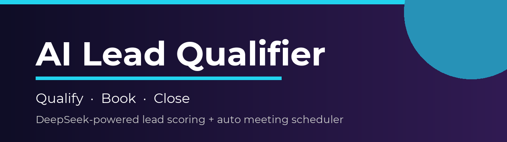
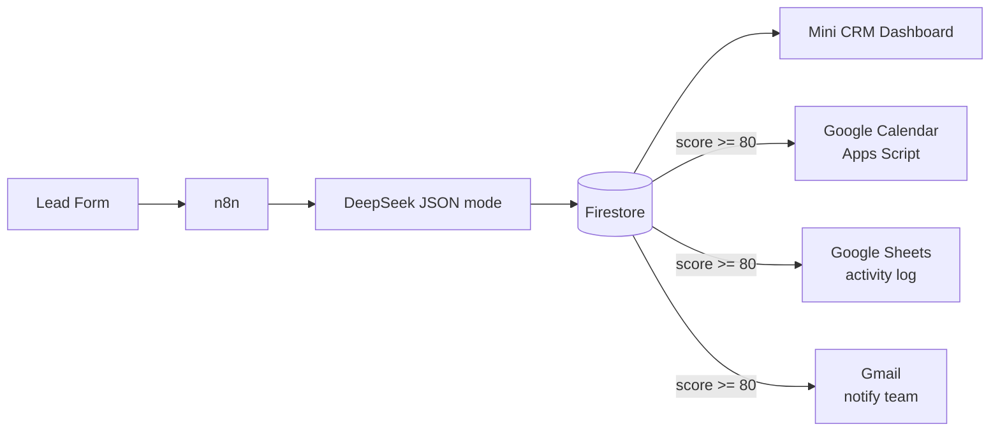

<p align="center">
  
</p>

<div align="center">

# ⚡ AI Lead Qualifier & Meeting Booker

**A lightweight AI-powered sales automation: capture leads, qualify them with
DeepSeek, and book discovery calls automatically.**


</div>

---

## 🔄 The Pipeline



High-priority leads get a **discovery call booked on the calendar**, an
**activity-log row**, and a **team notification** — all independent so one
service failing never breaks the others.

---

## ✨ Core Features

- 📝 Lead capture form with validation
- 🔗 n8n webhook integration
- 🧠 DeepSeek lead qualification (structured JSON)
- 🗄 Firestore persistence — the source of truth
- 📊 Mini-CRM dashboard with score / priority / status
- 📅 Google Calendar Discovery Call for high-priority leads
- 📈 Google Sheets operational activity log
- ✉️ Gmail notifications for high-priority leads
- 🛡 Duplicate protection (no double events / rows)
- 🔧 Independent error handling (Calendar / Sheets / Gmail)

> **LLM:** DeepSeek (`deepseek-chat`, JSON mode). This project intentionally
> does **not** use Gemini — every doc, code comment, and env name says DeepSeek.

---

## 🛠 Technology

| Layer | Technology |
| --- | --- |
| **Frontend** | React · TypeScript · Vite · Tailwind · React Router · lucide-react |
| **Orchestration** | n8n (HTTP Request node → DeepSeek) |
| **AI** | DeepSeek API — lead scoring / classification |
| **Data** | Firebase Firestore + security rules |
| **Workspace** | Google Apps Script · Calendar · Sheets · Gmail |
| **Hosting** | Vercel (frontend) · GitHub |
| **Quality** | Vitest |

---

## 📁 Project Structure

```text
.
├── src/
│   ├── components/     Layout, MetricCard, LeadTable, badges, states
│   ├── pages/          Dashboard, Leads, LeadDetail, NewLead
│   ├── services/       firebase.ts, leads.ts, api.ts
│   └── types/lead.ts
├── google-apps-script/ Apps Script Web App + manifest
├── n8n/                workflow.lead-qualifier.json (import)
├── docs/               PRD, architecture, data model, deployment, demo script
├── firebase.json / firestore.rules / firestore.indexes.json
└── .env.example
```

---

## 🚀 Getting Started (Local)

```bash
npm install
npm run dev          # http://localhost:5173
```

Copy `.env.example` → `.env` and add your Firebase web config and n8n webhook
URLs.

```bash
npm run typecheck
npm run build
npm test
```

### Setup steps

1. **Firebase** — create `ai-lead-qualifier-demo`, deploy rules:
   `firebase deploy --only firestore:rules -P ai-lead-qualifier-demo`
2. **n8n** — import `n8n/workflow.lead-qualifier.json`, add DeepSeek / Apps
   Script / Gmail / Firestore credentials, set `APPS_SCRIPT_URL`,
   `NOTIFY_EMAIL`, `DEFAULT_MEETING_START`
3. **Google Workspace** — follow `docs/GOOGLE_WORKSPACE.md`
4. **Vercel** — deploy with Vite settings, add `VITE_*` variables

Full walkthrough: [`docs/DEPLOYMENT.md`](docs/DEPLOYMENT.md).

---

## 📐 Repository Rules

- The AI integration is **DeepSeek** — searching for `gemini`
  (case-insensitive) should return nothing.
- **Never commit secrets** — DeepSeek key → n8n credentials; Apps Script
  secret → Script Properties; service account → n8n credential.
- Google Sheets is an operational **activity log**, not a database. Firestore
  is the source of truth.
- The frontend must keep working if the Sheet or Gmail is down.

---

## 🧰 Portfolio

Demonstrates: n8n, DeepSeek API, Firebase/Firestore, Google Workspace (Apps
Script + Calendar + Sheets + Gmail), REST/webhooks, JSON, React, TypeScript,
Tailwind, git, and AI-assisted development. See
[`docs/PORTFOLIO_DEMO.md`](docs/PORTFOLIO_DEMO.md) for the demo script.
